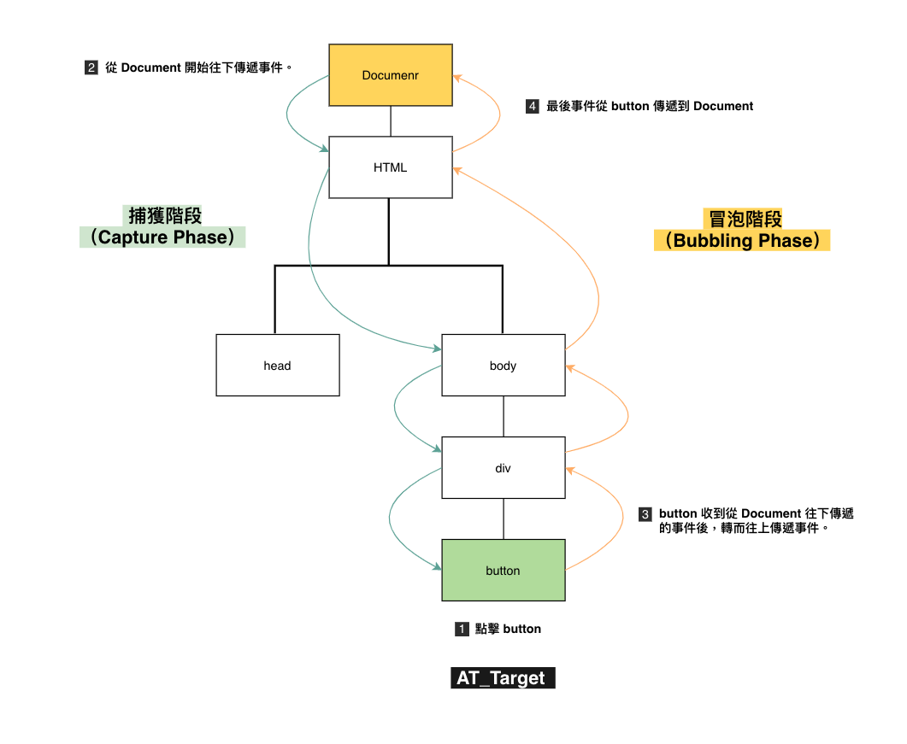

## 什麼是 DOM？

全名是 Document Object Model，將 XML 或 HTML Document 視為為有各種 node 物件的樹狀結構，方便 JavaScript 跟瀏覽器溝通。

讓人印象深刻的 DOM 圖。👇


## 事件傳遞機制的順序是什麼；什麼是冒泡，什麼又是捕獲？

事件傳遞機制分為三大階段：

1. 捕獲階段（capture phase）
2. 接收事件的元件本身（AT_TARGET）
3. 冒泡階段（bubbling phase）

假設網頁中有個按鈕，當我去點擊按鈕後，按鈕（target）接收到點擊事件，就開始整個點擊事件的傳遞機制：

1. 當按鈕被點擊後，就進入「捕獲階段」，事件從 DOM 最上層的 Document 開始往下傳遞，直到事件傳送到 **被點擊的按鈕**。
3. 當 **被點擊的按鈕** 接收到從 Document 傳過來的事件後，也就進入了 AT_TARGET 階段，轉而往上層傳遞事件。
4. 進入「冒泡階段」，直到最上層的 Document 接收到事件。

附上自己畫的圖來說明：



**為什麼需要知道事件傳遞機制？**

因為有監聽事件的順序問題。如果網頁中有多個監聽器時，到底哪個要先執行？
透過在安裝事件監聽器的時候，就能設定監聽事件的執行順序：[`element.addEventListener(type, listener [, useCapture]);`](https://developer.mozilla.org/en-US/docs/Web/API/EventTarget/addEventListener)。
`addEventListener()` 中的第三個參數 `useCapture` 是布林值，若是 true，代表要監聽捕獲階段傳來的事件，false 則代表要監聽冒泡階段傳來的事件。

所以在同個 target 設定兩個監聽器，監聽同個事件，但一個指定監聽獲階段的，另一個監聽冒泡階段的

```javascript
element.addEventListener(type, listener, true); //監聽捕獲階段
element.addEventListener(type, listener, false); //監聽冒泡階段
```

監聽事件的執行順序就會是事件傳遞機制所說明的順序那樣，先是捕獲階段的，再來才是冒泡階段的。

但需要注意一開始接收到事件的 target（例如：被點擊的按鈕）比較特別，因為不屬於捕獲階段，也不屬於冒泡階段，而是在 AT_TARGET 階段，所以就沒有捕獲階段或冒泡階段的差別，看的是 `addEventListener()` 的順序，先安裝的監聽器，就先使用。

## 什麼是 event delegation，為什麼我們需要它？

事件代理（event delegation），運用了事件傳遞機制的特色，由於事件會在 target 被觸發後，依順序由最上往 target，再由 target 往上傳遞，  
所以在監聽物件的 parent node 安裝事件監聽器，一旦 parent node 的子項目被事件觸發，parent node 也會被事件傳遞到。  
通常用在 parent node 的子項目是動態產生的，或者有子項目數量很多的情況。

例如在本週的待辦清單作業，為了做到點選特定待辦項目中的刪除鍵，該項目就要被刪除，會用一個 div 包住所有待辦項目，並把事件監聽器設定在 div 上，  
這時 div 擔任的就是事件代理，這樣做可解決直接在刪除鍵安裝事件監聽器的兩大問題：

1. 因為待辦項目是動態產生的，不會在一開始就寫入 HTML 檔案中，當使用者新增項目時才會出現，如果待辦項目本來就是空的，就無法先在每個待辦項目的刪除鍵安裝事件監聽器。
2. 如果待辦項目超多，就要裝好多個監聽器。

由於包住所有待辦項目的 div 本來就會被寫在 HTML 檔案內，而且不論使用者點擊哪個待辦事項中的刪除鍵，都會把事件也傳遞給 div，這樣只需要裝一個事件監聽器就夠了。

## event.preventDefault() 跟 event.stopPropagation() 差在哪裡，可以舉個範例嗎？

兩者的差別在於「跟事件傳遞機制是否有關係？」。  
`event.preventDefault()` 是阻止瀏覽器預設的行為；`event.stopPropagation()` 是停止事件繼續傳遞，讓事件不會被傳到下個節點（node）。  
`event.preventDefault()` 跟事件傳遞機制無關，例如瀏覽器給按下（click）表單中的 button 預設行為是送出表單（submit），當在 button 放 `preventDefault()` 後，就會阻止瀏覽器預設的送出表單行為，也就是按下 button 後沒反應，但 click 事件仍會繼續傳遞，除非加上 `event.stopPropagation()` 才能停止事件繼續傳遞。